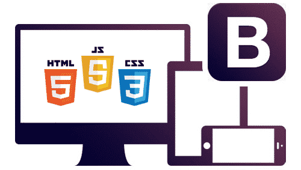

# Web Front-end

  

## Projects
Here you can find front-end technologies projects:  
[0x00. Advanced HTML](./0x00-html_advanced/)  
[ 0x01. Developer tools](./0x01-developer_tools/)  
[0x02. Advanced CSS](./0x02-CSS_advanced/)  
[0x03. Sass & Scss](./0x03-sass_scss/)  
[0x04. Flexbox](./0x04-flexbox/)  
[0x05. Forms](./0x05-form/)  
[0x06. Responsive design](./0x06-responsive_design/)  
[0x07. Accessibility](./0x07-accessibility/)  
[0x0A. Bootstrap ](./0x0A-Bootstrap/)  
[ 0x0C. JavaScript advanced](./0x0C-Javascript_advanced/)  
[0x0D. jQuery advanced](./0x0D-JQuery_advanced/)  
[0x0E. Cookies & local storage](./0x0E-Cookies_local_storage/)  

